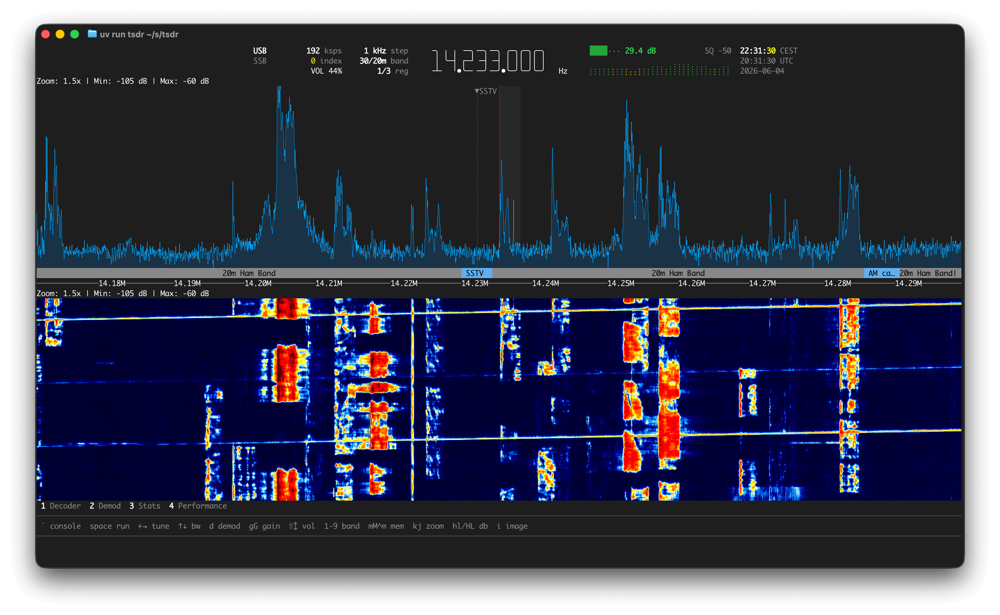

# TSDR

TSDR is a terminal user interface for software-defined radio. It provides a
real-time spectrum display, a waterfall, audio demodulation, and a set of
protocol decoders, all driven from the keyboard.

It is aimed at users who prefer keyboard-driven, terminal-based tools and value
simplicity. The terminal UI handles tuning and visualization, while the console
exposes the full feature set through commands. This makes TSDR usable both as an
interactive radio and as a general SDR toolkit.

> **Note:** TSDR is in heavy development. Interfaces and commands may change.



## Features

- Real-time spectrum and waterfall display, with optional Kitty graphics for
  high-frame-rate image rendering.
- Audio demodulators: WFM (with stereo and RDS), NFM, AM, USB, LSB (SSB), CW (Morse).
- Protocol decoders: RDS, FLEX paging (2-FSK), ADS-B (1090 MHz Mode S), DAB+
  (AAC), DMR (AMBE+2), TETRA (ACELP), FT8/FT4 (WSJT-X), APRS (AFSK1200/AX.25),
  and SSTV (Martin/Scottie/Robot).
- Multiple devices and multiple independent processing pipelines per device.
- A command console with history, tab-completion, and argparse-style help.
- Frequency memories, bandplan overlays, IQ recording, and squelch.
- Runs on Linux, macOS, and Windows.

## Requirements

- Python 3.14 or newer.
- A supported SDR device, or a recorded IQ file to play back.
- A modern, full-featured terminal emulator. [Ghostty](https://ghostty.org) is
  recommended on Linux and macOS for its broad protocol support. Image mode uses
  the Kitty graphics protocol; Ghostty and [Rio](https://rioterm.com/) render it
  best. On Windows, use Rio or a recent
  [Windows Terminal](https://github.com/microsoft/terminal) (Terminal Preview
  preferred), where only Rio supports Kitty images.

Supported device types: `rtltcp`, `rtlsdr`, `spyserver`, `soapy` (any
SoapySDR-compatible device), `iq-file`.

## Installation

TSDR is not published on PyPI (yet). Install it directly from GitHub with
[uv](https://docs.astral.sh/uv/):

```
uv tool install --from git+https://github.com/floens/tsdr tsdr
```

Direct RTL-SDR USB support (the `rtlsdr` device type) requires the optional
`rtlsdr` extra:

```
uv tool install --from git+https://github.com/floens/tsdr "tsdr[rtlsdr]"
```

### SoapySDR support

The `soapy` device type uses [SoapySDR](https://github.com/pothosware/SoapySDR),
which is not a pip package. Its Python bindings ship with the system C++
library, so it is installed through the OS package manager, along with the
driver module for the target hardware. TSDR then detects the system installation
automatically by probing the usual Homebrew and apt site-package locations, so
the isolated uv/pipx environment finds it without extra configuration.

On macOS, the Homebrew formula builds the Python bindings; driver modules come
from the Pothos tap:

```
brew install soapysdr
brew tap pothosware/homebrew-pothos
brew install soapyrtlsdr      # or soapyhackrf, soapyairspy, soapyremote, ...
```

On Debian/Ubuntu:

```
sudo apt install python3-soapysdr soapysdr-tools
sudo apt install soapysdr-module-rtlsdr   # or -hackrf, -airspy, -remote, ...
```

Run `scan` in the console to enumerate the devices SoapySDR can see.

### Checking your terminal

After installing, run the built-in diagnostic to verify that your terminal and
environment support everything TSDR needs (notably the graphics protocol used by
image mode):

```
tsdr doctor
```

Use `tsdr doctor --check` for a non-interactive report that exits non-zero on
failure, or `tsdr doctor --json` for machine-readable output.

## Usage

Start the application:

```
tsdr
```

You can run commands automatically on startup with `--exec` (repeatable), for
example to add and start a device:

```
tsdr -e "add rtl0 --type rtltcp --host 192.168.1.10" -e "start rtl0"
```

Other entrypoint flags:

- `-e`, `--exec COMMAND`: run a console command on startup (may be repeated).
- `--headless`: run without the TUI; logs go to stdout and commands are read
  from stdin.
- `-v`, `--verbose`: enable debug logging.

### The console

Press `` ` `` (backtick) to focus the command console. The console behaves like
a shell:

- Type a command and press Enter to run it.
- Press `Tab` / `Shift+Tab` to cycle autocompletion (command names, device IDs,
  flag values).
- Use the arrow keys or `Ctrl+R` to browse and search history.
- Press `` ` `` or `Escape` to return focus to the spectrum.

### Discovering commands

Run `help` to list all commands with a one-line description of each. To see the
options for a single command, run it with no arguments or pass `-h`, which prints
its argparse usage and flags. For example:

```
help
demod -h
config -h
```

A typical session: add a device, start it, tune, and pick a demodulator.

```
add rtl0 --type rtlsdr
start rtl0
f 100.1M
demod wfm
```

Common commands include `add`, `remove`, `start`, `stop`, `list`, `focus`, and
`config` (device management); `f` (tune), `demod` (select a demodulator or
decoder), `squelch`, `denoise`, and `audio` (audio); `memory` and `bandplan`
(frequency presets); `record` (IQ capture); and `pipeline` (inspect or modify
processing stages). See `help` for the full list.

### Keyboard controls

When the console is unfocused, the spectrum responds to the keyboard directly.

Tuning:

- `←` / `→`: tune down / up one step.
- `Shift+←` / `Shift+→`: tune one coarse step.
- `Alt+←` / `Ctrl+←`, `Alt+→` / `Ctrl+→`: tune one fine step.
- `[` / `]`: jump to the previous / next tuning target (memory or band).
- `s` / `S`: cycle the tuning step size forward / backward.

Reception:

- `↑` / `↓`: adjust channel bandwidth.
- `Alt+↑` / `Ctrl+↑`, `Alt+↓` / `Ctrl+↓`: adjust channel bandwidth finely.
- `g` / `G`: decrease / increase RF gain.
- `Ctrl+G`: toggle AGC.
- `u` / `U`: lower / raise the squelch threshold.
- `Ctrl+U`: disable squelch.
- `Shift+↑` / `Shift+↓`: decrease / increase volume.
- `n`: toggle RNNoise denoising.
- `Space`: start / stop the focused device.
- `d` then a second key: switch demodulator (`w` WFM, `n` NFM, `a` AM,
  `u` USB, `l` LSB, `c` CW, `o` off).

Display:

- `i`: toggle image mode.
- `k` / `j`: zoom the spectrum in / out.
- `h` / `l`: raise / lower the noise floor (spectrum dB minimum).
- `H` / `L`: raise / lower the ceiling (spectrum dB maximum).

Memories and panels:

- `m`: save a memory at the current frequency.
- `M`: edit the nearest memory.
- `Ctrl+M`: delete the nearest memory (press `y` to confirm).
- `1` to `9`: toggle the dockable panel mapped to that key.
- `Ctrl+S`: toggle the stats panel; `Ctrl+P`: toggle the performance panel.
- `Ctrl+1` to `Ctrl+9`: recall a band-stack slot; `Ctrl+0`: swap the A/B band stack.

When the console is focused:

- `` ` `` or `Escape`: return focus to the spectrum (`Escape` first dismisses
  an open autocomplete menu).
- `Tab` / `Shift+Tab`: open and cycle the autocomplete menu forward / backward.
- `↑` / `Ctrl+P`, `↓` / `Ctrl+N`: previous / next history entry.
- `Ctrl+R`: search history.
- `Ctrl+L`: clear the console.

## Configuration and data

Logs and preferences are stored in a per-user directory managed by
[platformdirs](https://pypi.org/project/platformdirs/):

- Linux: `~/.config/tsdr` (or `$XDG_CONFIG_HOME/tsdr`)
- macOS: `~/Library/Application Support/tsdr`
- Windows: `%APPDATA%\tsdr`

The `paths` command prints the exact location and its contents. Some
configuration (such as the last device and demodulator) is persisted there and
restored on startup.

## Design

The architecture, goals, and non-goals are described in [DESIGN.md](DESIGN.md).
At a high level, a `core` layer owns all SDR logic (devices, workers, pipelines,
the event bus), and a `tui` layer renders it. s written in Python so it is easy
to read, modify, and experiment with, with hot DSP paths accelerated by NumPy
and Numba.

## Development

Parts of TSDR were written with the help of LLMs.

## Acknowledgments

TSDR includes code derived from or inspired by several other projects. See
[ACKNOWLEDGMENTS.md](ACKNOWLEDGMENTS.md).

## License

TSDR is licensed under the GNU General Public License, version 2 or later. See
[COPYING](COPYING).
